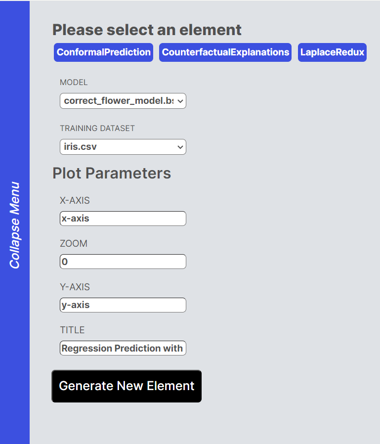

# Conformal Prediction 

In order to learn about a Machine Learning model , we can find how certain a model's assumptions and predctions are. Here we provide that estimate through computing a set of probable labels for a given input. The output we get is a graph including the true membership (conformal probability) for each set of labels.

## Supported model types

Conformal prediction only supports one-dimensional regression models, for example the Symbolic Regression. The model should be in BSON form.

## Supported data types

The datasets should be one dimensional and have two columns , with the last column being values . They should be in CSV form.

## How to Use 

1 - Open the sidebar and select "Conformal Prediction"

2 - Load a dataset with the "Import Dataset" button on the sidebar 

3 - Load a model with the "Import Model" button on the sidebar 

4 - Add your chosen labels for x and y titles 

5 - Click on "Generate New Element" and refresh the page. You should be able to see a Laplace Redux graph on your dashboard

