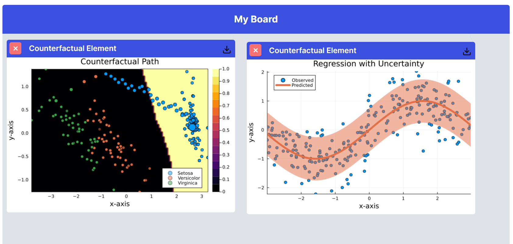

# Counterfactual Explanation

In order to understand the choices a specific Machine Learning Model makes, we can construct a counterfactual explanation for the model - which would explain a certain alternative choice the model could make and what it needs to change in order to achieve that.

## Supported model types

Counterfactual explanation supports all models, including classification and regression. All models should be in bson form.

Due to bottomnecks regarding taija plotting, we can only display two parameters on the graph.

## Supported data types

Counterfactual explanation supports any dataset, as long as it is in in CSV form.

## How to Use 

1 - Open the right sidebar

1 - Load a dataset with the "Import Dataset" button on the sidebar 

2 - Load a model with the "Import Model" button on the sidebar 

3 - Choose the Target Class (the parameter we expect to achieve) and the Factual Class (the parameter we want to compare it to)

4 - Choose your preferred generator.

5 - Add your chosen labels for x and y titles 

6 - Click on "Generate New Element" and refresh the page. You should be able to see a Counterfactual Explanations graph on your dashboard

