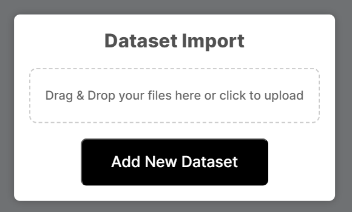
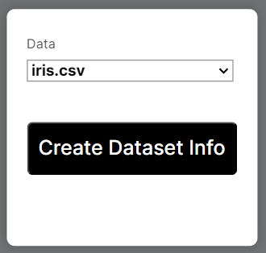
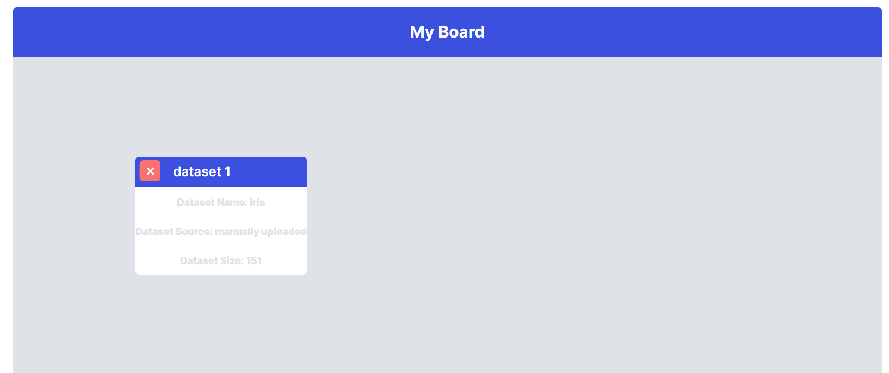

# Handling Data

Currently, you can only upload datasets as CSV files. You need to follow the conventional way of representing datasets. The top row should be the names of the columns the first few columns should represent the feautre matrix and the last one should represent the labels.

Loading a dataset can be done through clicking the "Import Dataset" button on the side bar.

## Displaying Datasets

Apart from loading a dataset to be used later, we can also display its main parameters and properties as a Dataset Element. This is done easily through clicking the "Add Dataset Info" button.

The dataset will be displayed like this:

