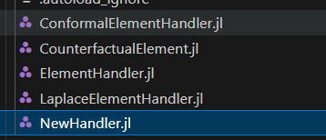
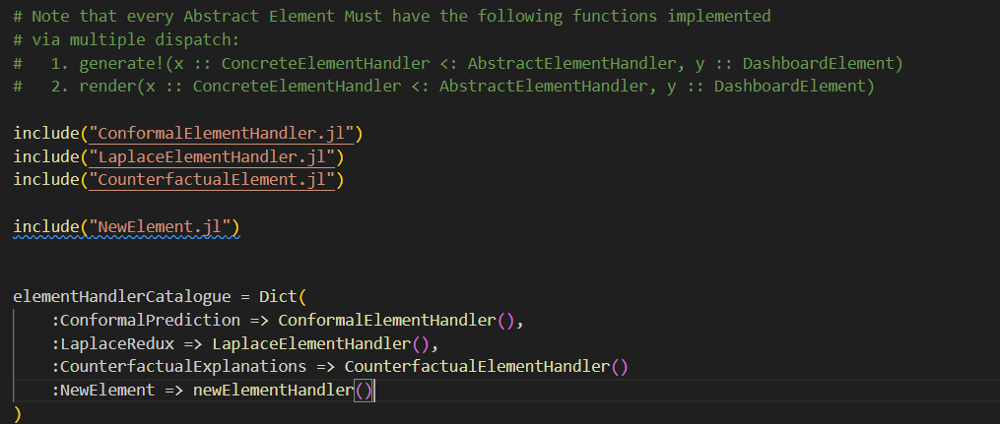
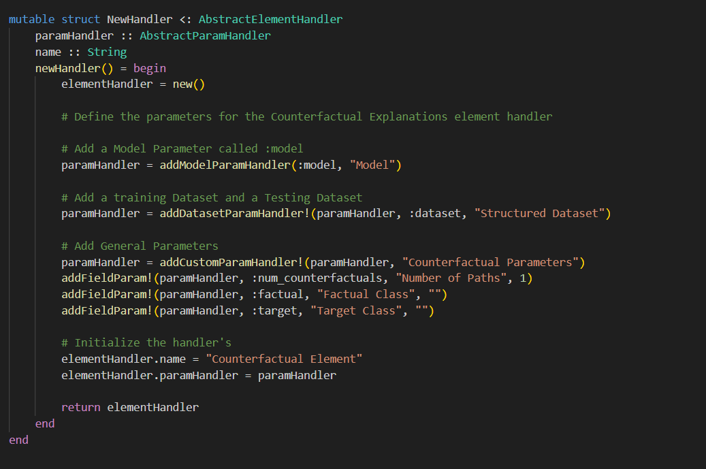
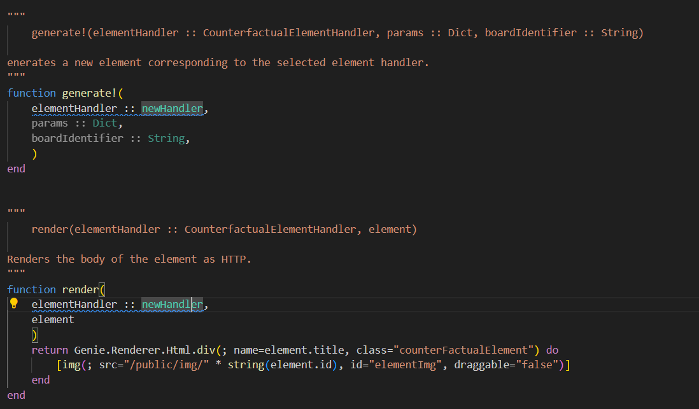
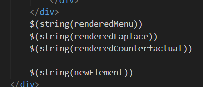

# Extending the application

While we are currently able to offer three main functions - Laplace Redux, Conformal Prediction and Counterfactual Analysis , we allow the option to extend our functionalities. 


# How to add a new framework?


Our app's functionality is mainly based around two parts: 

* Param Handlers - which handle the way form elements (selectors, text inputs etc) are viewed. We do not need to touch that area.

* Element Handlers - which handle the way newly added frameworks are rendered. This is the main part we will be working through this how-to.

1 - Create a new file in the element handlers folder and choose a name





2a - Go to ParamHandler.jl, and include the name of the new handler like this:

``` julia
include("newElement.jl")
```

2b - Add it to the array called "elementHandlerCatalogue" like this:

``` julia
 :newHandler => newElementHandler()
```

It should look like this:





3 - Add the following code to it. This will generate dataset and model selectors





4 - Add the generation of the graph in the generate!() part. This will generate your customized algorithm, as the user clicks the submit button.

5 - Add rendering. If your algorithm outputs a png file , you do not need to change a thing. Otherwise you can include titles or text as you like



6 - Add the route to dashboard_view.jl.html so that it can be accessed.



Now you should have your new classifier all set up and ready to use!