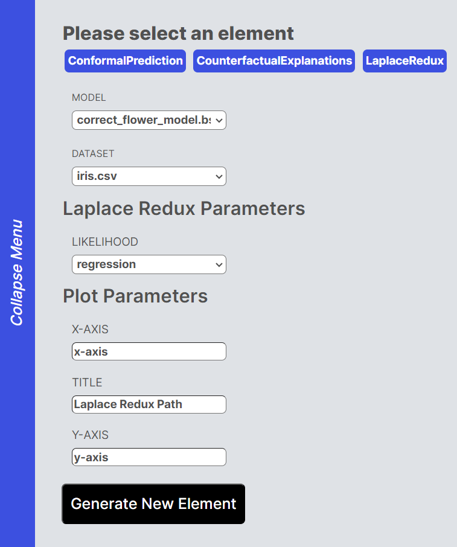
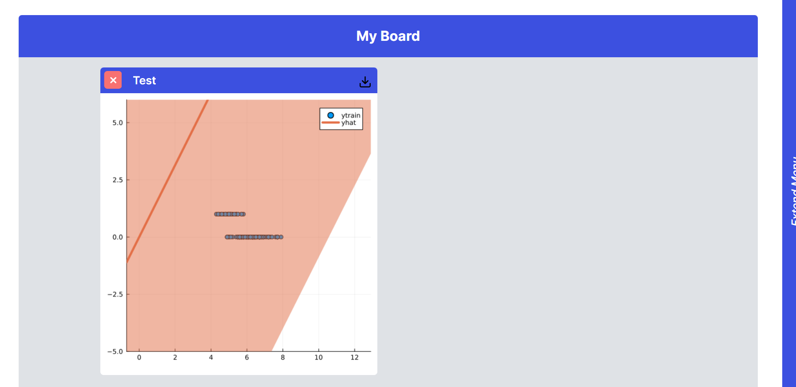

# Laplace Redux

In order to learn more about a Machine Learning model , we can find how certain a model's assumptions and predictions are. Laplace Redux achieves that by transforming the model into a Bayesian Neural Network and performing a Laplace Approximation on it. 

## Supported model types

Laplace redux supports both Regression and Classification models in bson format. 

Due to limitations imposed by the Julia plotting library , we can only plot up to two dimensions of data in classification models and  , and thus any classification model that uses more than two dimensions will be compressed into a two dimensional one. 

It is important to note that at this stage only models from Flux are processable, so the algorithm would not work with transformer models. 

## Supported data types

Classification - Any dataset in csv form that has at least 2 dimensions . In the current version - only the first 2 dimensions will be presented , but parameter costumization will be possible in the future.

Regression - Any dataset in csv form that has at least 1 dimensions. 

## How to Use 

1 - Open the sidebar and select "Laplace Redux"

2 - Load a dataset with the "Import Dataset" button on the sidebar 

3 - Load a model with the "Import Model" button on the sidebar 

4 - Select the dataset and model you loaded and specify whether the model is Regression or Classification. 

5 - Add your chosen labels for x and y titles 

6 - Click on "Generate New Element" and refresh the page. You should be able to see a Laplace Redux graph on your dashboard

