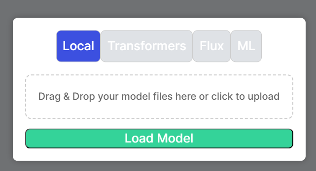
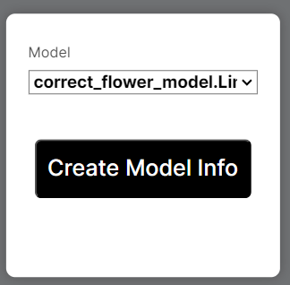
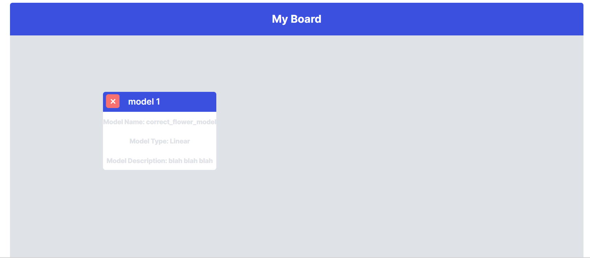

# Models

## Supported model types
Ourapplication only supports models in BSON formats currently.

## Sources of models

Currently, you can acquire models from three sources:
1. Upload one from your local machine.
2. Train one using on the classifier screen (`this uses CounterfactualEplanations's fit_model`).
3. Download one from HUggingFace after logging in using a key.

Loading a model can be done through clicking the "Import Model" button on the side bar.

## Displaying Models

Apart from loading a model to be used later, we can also display its main parameters and properties as a Model Element. This is done easily through clicking the "Add Model Info" button.

The model will be displayed like this:

