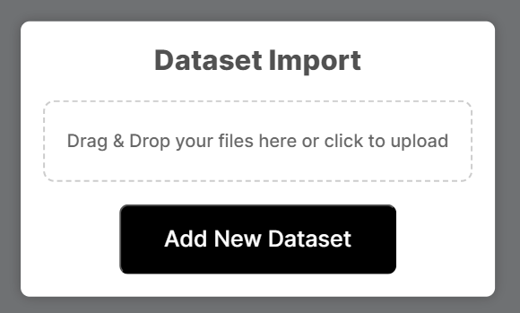
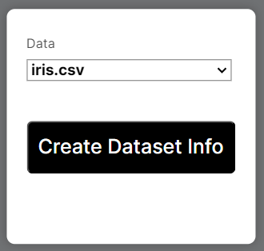
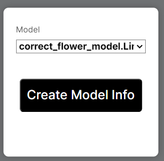
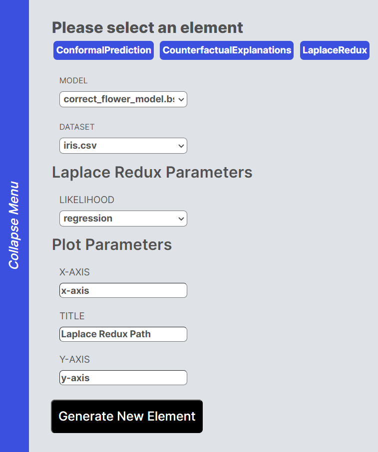

# Whistle-Stop Tour

In this tutorial, we will go through a slightly more complex example using our already uploaded dataset and model. We will generate Counterfactual Explanations using different generators and visualize the results.

## Data and Classifier

You can see our existing dataset and classifier here. In order to use them for further computations, we will need to add them with the "Import Dataset" and "Import Model" buttons respectively.

Adding a Dataset:

Adding a model:

## Learning about the Dataset and Model

Now that we have loaded the dataset and classifier, we can add information about them to our board. This can easily be done by clicking the "Add Dataset Info" and "Add Model Info" buttons located at the very bottom of the sidebar. We should receive an image containing explanation about both of them respectively

Adding Dataset Info:

Adding Model Info:

## Counterfactual Explanation

Next, we begin by specifying our target and factual label.

This sets the baseline for our counterfactual search: we plan to perturb the factual `x` to change the predicted label from `y`=setosa to our target label `target`=virginica.

Counterfactual generators accept several default parameters that can be used to adjust the counterfactual search at a high level: for example, a `Flux.jl` optimizer can be supplied to define how exactly gradient steps are performed. Importantly, one can also define the threshold probability at which the counterfactual search will converge. This relates to the probability predicted by the underlying black-box model, that the counterfactual belongs to the target class. A higher decision threshold typically prolongs the counterfactual search.

In the example below we ran the counterfactual search for each generator available in the `generator_catalogue`. The chart below shows the results for all counterfactual generators: Factual: setosa → Target: virginica.

## Laplace Redux

Now that you generated the Counterfactual Explanation, we can learn more about our model through laplace reducing it. Since our model is classification, we will select the `likelihood`=classification. We can leave the x , y and title values as is . Now our board will also contain a Laplace Redux value.

Before:

After:

